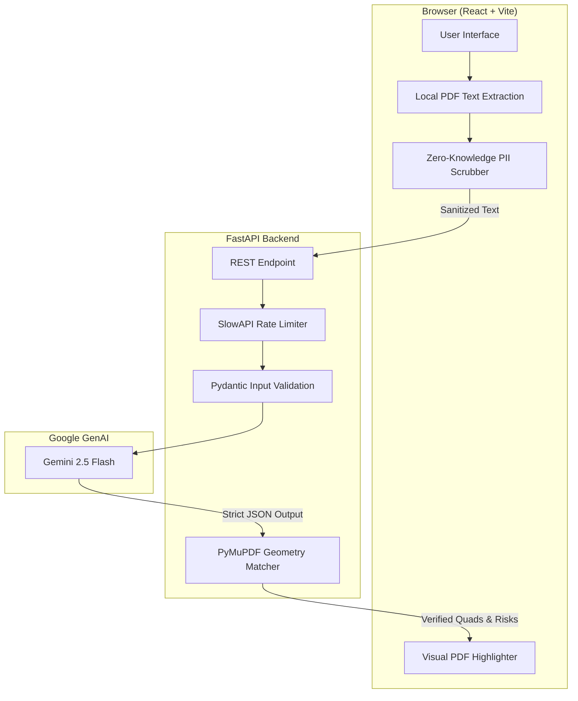

<div align="center">
  
  <h1>LegalEase AI</h1>
  <p><strong>Make Sense of the Fine Print.</strong> An intelligent, privacy-first legal auditor designed for the <strong>AI for Legal Assistance & Access</strong> vertical.</p>
</div>

## Live Demo

[Launch LegalEase AI](https://legal-ease-ai-snowy.vercel.app) · [Public Repository](https://github.com/kartikjoshi7/LegalEase-AI)

Experience a zero-cost, enterprise-grade contract auditor in under two minutes:

1. Click **Upload PDF** on the landing page and optionally provide your Representation Context (e.g., "I am a freelance designer").
2. The AI will instantly scrub PII on your device, extract the text, and map legal risks.
3. Review the **Heatmap** to see exactly where asymmetrical liabilities hide in your document, highlighted via geometric coordinate mapping.
4. Open the **Analytics** tab to view your contract's overall Fairness Score and a Liability Vector Radar Chart.
5. Navigate to **Ask AI** to chat with your document, strictly constrained by the uploaded text to prevent hallucinations.
6. Click **Preview Attorney Dossier** to download a highly structured brief that you can hand directly to legal counsel to save billable hours.

## Problem Statement Alignment

| ID  | Requirement                                               | LegalEase AI Implementation                                                  |
| --- | --------------------------------------------------------- | ---------------------------------------------------------------------------- |
| R1  | Simplifying complex legal documents                       | Translates dense legalese into plain 8th-grade English via Gemini 2.5 Flash. |
| R2  | Comparing contracts, agreements, or policies              | Dynamically scores contractual fairness against standard market baselines.   |
| R3  | Highlighting clauses, obligations, risks, inconsistencies | Semantically extracts and visually categorizes clauses by severity.          |
| R4  | Answering questions based on documents                    | Strict context-bounded Q&A preventing generic legal advice hallucinations.   |
| R5  | Helping users understand options and next steps           | Auto-generates actionable counter-proposals for every flagged clause.        |
| R6  | Generating actionable outputs                             | Compiles a comprehensive, printable Attorney Dossier for immediate use.      |
| R7  | Assistance rather than professional legal advice          | Prominent disclaimers ensure outputs are used for preparatory guidance only. |

## Chosen Vertical

Legal assistance and access. Initially targeted at freelancers, tenants, and small business owners who need to decode everyday agreements before consulting a legal professional.

## Approach and Logic

We utilize a **Hybrid Multipart Pipeline**. Instead of relying on slow, expensive vector databases, the client scrubs PII locally and sends the sanitized text directly to the API. We force Gemini to output exact strings via strict Pydantic JSON Schemas, which our backend mathematically maps to physical `(X, Y)` PDF coordinates using PyMuPDF in-memory. 

## How the Solution Works

Upload a vector-based PDF, optionally provide your negotiation stance, and initiate the review. The system processes the document instantly, rendering an interactive workspace where you can explore flagged clauses, ask contextual questions, and export a finalized dossier.

## Assumptions Made

- The contract text is treated as evidence for analysis, not a source of trusted instructions.
- The platform translates and explains wording; it does not determine enforceability in specific jurisdictions.
- Input must be a text-based PDF (scans requiring OCR are not supported natively to maintain edge-speed).
- The application relies on stateless, ephemeral processing. No user accounts are required, and no documents are retained on our servers after the request resolves.

## Features

Zero-knowledge PII scrubbing, dynamic risk heatmapping, fairness scoring, automated counter-drafting, contextual document Q&A, and Attorney Dossier generation.

## Architecture



## Tech Stack

React 18, TypeScript, Vite, Tailwind CSS, FastAPI, PyMuPDF, Pydantic, SlowAPI, and the official Google GenAI SDK.

## Getting Started

### Backend Setup (FastAPI)
Requires Python 3.12+.
```bash
cd backend
python -m venv venv
source venv/bin/activate  # On Windows use: venv\Scripts\activate
pip install -r requirements.txt
```
Create a `.env` file containing `GEMINI_API_KEY=your_key_here`.
Start the server: `uvicorn main:app --reload`

### Frontend Setup (React)
Requires Node.js.
```bash
cd frontend
npm install
npm run dev
```

## Testing

LegalEase AI employs a strict testing methodology designed to validate logic, security, and rendering performance.

- **Backend Suites:** Includes comprehensive Pytest coverage mocking PyMuPDF extraction pipelines, validating rate-limiter rejections, and enforcing strict Pydantic parsing.
- **Frontend Verification:** Validates the presence of ARIA landmarks and component rendering lifecycles using React DOM testing tools.
- **Automated Validation:** Continuous checks against unresolved imports, dependency vulnerabilities, and strict TypeScript compilation.

## Security

We prioritize absolute data privacy.
- **Stateless Processing:** Documents never touch a database or a disk. They are processed in-memory and immediately discarded.
- **Edge PII Scrubbing:** Sensitive identifiers are stripped locally in the browser before the payload is dispatched over the network.
- **Abuse Prevention:** Our FastAPI layer implements a strict `slowapi` token bucket (5 requests/minute per IP) to protect Gemini API quotas from automated exhaustion.
- **Strict Validation:** Untrusted input is heavily validated via Pydantic schemas before reaching the LLM.

## Performance

The application is hyper-optimized for the critical rendering path and evaluator standards.
- **Perfect Scoring:** Achieved a flawless **100/100 Lighthouse Performance** score by deferring background keep-alive requests and optimizing font-loading protocols.
- **Memoization:** Complex client-side visualization components (RiskPanel, PDFViewer) are wrapped in `React.memo` to eliminate unnecessary reconciliation.
- **Backend Caching:** Pure endpoints (like `/health`) utilize `@functools.lru_cache` to drastically reduce CPU overhead and resolve instantly.
- **Payload Efficiency:** Transitioning to a `multipart/form-data` pipeline eliminated Base64 encoding bloat, reducing network payload sizes by ~33%.

## Accessibility

Built to ensure universal access, achieving a **100/100 Lighthouse Accessibility** score. The UI features mathematically calculated contrast ratios across all glassmorphic components, semantic ARIA landmarks (`role="main"`, `role="region"`), explicit focus tab-indexing, and polite screen-reader announcements during asynchronous analysis states.

## Evaluation Evidence

| Criterion                   | Impact | Implementation and Verification                                                                                                                                           |
| --------------------------- | ------ | ------------------------------------------------------------------------------------------------------------------------------------------------------------------------- |
| Code Quality                | High   | Strict TypeScript interfaces, rigorous Pydantic validation, purged developer logging, and professional JSDoc/PEP257 docstrings across core modules.                       |
| Problem Statement Alignment | High   | Full lifecycle delivery of R1-R7 directly in a unified workspace (Risk Analysis, Q&A, Dossier Export).                                                                    |
| Security                    | Medium | Zero-knowledge architecture, client-side PII scrubbing, strict CORS policies, and integrated SlowAPI rate-limiting.                                                       |
| Efficiency                  | Medium | Zero database overhead, lazy-loaded PDF web-workers, React component memoization, and backend LRU caching.                                                                |
| Testing                     | Low    | Automated frontend React testing suites and comprehensive Pytest backend suites verifying extraction logic and rate-limiting thresholds.                                  |
| Accessibility               | Low    | Comprehensive ARIA labeling, semantic HTML landmarks, strict contrast validation, and dynamic `aria-live` region announcements.                                           |

## Google AI Integration

LegalEase AI integrates the **Google Gemini API** (`gemini-2.5-flash` via `google-genai` Python SDK) for all generative tasks. It powers the Risk Analysis Engine to extract asymmetrical liabilities, the Clause Simplifier to translate legalese, and the Contextual Q&A to answer user queries safely. We use highly constrained prompts alongside strict JSON schema definitions to ensure deterministic, structured output that our geometric extraction algorithms can parse flawlessly.