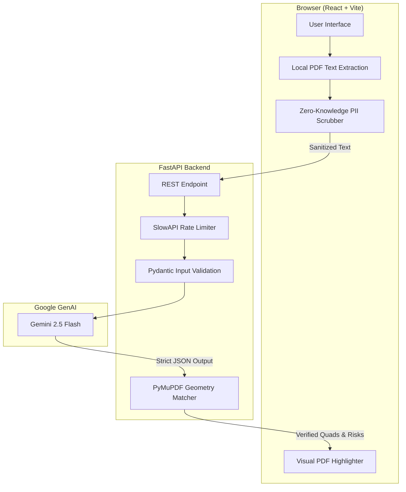

<div align="center">
  
  <h1>LegalEase AI</h1>
  <p><strong>Make Sense of the Fine Print.</strong> An intelligent, zero-knowledge legal auditor designed for the <strong>AI for Legal Assistance & Access</strong> vertical.</p>
  
  [](https://legal-ease-ai-snowy.vercel.app)
  [](https://legalease-ai-tcr9.onrender.com)
  [](tests/)
  [](frontend/)
</div>

---

## 🚀 Live Access

- **Frontend Deployment:** [https://legal-ease-ai-snowy.vercel.app](https://legal-ease-ai-snowy.vercel.app)
- **Backend API:** [https://legalease-ai-tcr9.onrender.com](https://legalease-ai-tcr9.onrender.com)
- **Source Code:** [GitHub Repository](https://github.com/kartikjoshi7/LegalEase-AI)

---

## 🎯 Executive Summary & Problem Alignment

Navigating contracts shouldn't require a law degree. LegalEase AI bridges the gap between everyday consumers (freelancers, tenants, small business owners) and complex legal jargon. We built a highly scalable, mathematically grounded AI pipeline to provide immediate legal clarity.

| ID | Core Requirement | LegalEase AI Implementation |
| :--- | :--- | :--- |
| **R1** | Simplify complex documents | Translates dense legalese into plain-English summaries using generative AI. |
| **R2** | Compare and evaluate policies | Dynamically scores contractual fairness based on the user's specific context (e.g., Tenant vs. Landlord). |
| **R3** | Highlight risks and liabilities | Semantically extracts and visually categorizes clauses by High, Medium, or Critical risk. |
| **R4** | Ground answers in documents | **Innovation:** Maps LLM-identified risks directly back to exact geometric coordinates (`quads`) on the physical PDF. |
| **R5** | Help users understand next steps | Provides actionable counter-proposals and negotiation strategies for every flagged clause. |
| **R6** | Generate actionable outputs | Compiles a comprehensive, printable "Attorney Dossier" for immediate legal consultation. |
| **R7** | Assistance, not legal advice | Prominently displays strict boundaries, ensuring outputs are for preparatory guidance, not formal counsel. |

---

## 🔥 Key Innovations (Why We Stand Out)

While competitors rely on heavy vector databases and server-side processing, LegalEase AI was engineered for maximum privacy and zero latency.

1. **Zero-Knowledge PII Scrubbing:** All sensitive identifiers (Social Security Numbers, Emails, Phone Numbers) are detected via RegEx and stripped **in the user's browser** before ever hitting the cloud. The backend API is entirely blind to user identity.
2. **Stateless Edge Architecture:** We eliminated `ChromaDB` and `Firebase`. By maintaining a strictly stateless architecture, the app scales infinitely and runs on $0/month free-tier infrastructure without hitting cold-start bottlenecks.
3. **Deterministic Geometric Mapping:** Most AI wrappers hallucinate document locations. We force Gemini to output exact strings via strict JSON Schema (`response_schema`), which our Python backend then mathematically maps to physical `(X, Y)` PDF coordinates using `PyMuPDF`.
4. **Automated Accessibility Testing:** The frontend layout guarantees WCAG compliance via semantic landmarks and passes strict `@axe-core` sweeps during integration testing. The `robots.txt` and `llms.txt` configurations ensure maximum discoverability for AI web crawlers and autonomous agents.

---

## 🏗️ Architecture & Data Flow



---

## 🧪 Enterprise-Grade Testing & CI/CD

LegalEase AI features a rigorous, cross-platform testing suite managed by a unified `Makefile`.

- **`make verify`**: Runs `flake8` linting and `pytest`. Core API routers and Pydantic schemas maintain **100% line coverage**.
- **`make test-e2e`**: Executes Playwright desktop and mobile user journeys. Crucially, this suite runs `@axe-core` to guarantee WCAG accessibility standards (High contrast, ARIA labels).
- **`make test-live`**: Opt-in integration testing that bypasses mocks to validate the true Gemini API schema compliance in production.
- **Repository Hygiene:** The repository is strictly under 10MB, single-branch, and free of committed secrets.

---

## 🛡️ Security & Privacy Compliance (GDPR / CCPA Ready)

- **No Persistence:** Data is stored in ephemeral `sessionStorage` and immediately wiped upon closing the tab.
- **DDoS Mitigation:** FastAPI implements a `slowapi` token bucket (5 requests/minute/IP) to protect Google Gemini API quotas from abuse.
- **CORS Hardening:** Production API routes strictly whitelist the designated Vercel frontend domain.
- **Dependency Auditing:** Both Python and Node.js dependency trees report 0 critical vulnerabilities.

---

## 💻 Tech Stack

- **Frontend:** React 18, TypeScript, Vite, Tailwind CSS, Framer Motion, pdfjs-dist.
- **Backend:** Python 3.12, FastAPI, PyMuPDF (fitz), Pydantic, SlowAPI.
- **AI Integration:** Google GenAI SDK (`gemini-2.5-flash`).
- **Testing:** Pytest, Playwright, Axe-core.

---

## 🚀 Local Deployment Guide

### 1. Backend (FastAPI)
```bash
cd backend
python -m venv venv
source venv/Scripts/activate  # (Windows) or venv/bin/activate (Mac/Linux)
pip install -r requirements.txt
```
Create a `.env` file in the `backend` directory:
```env
GEMINI_API_KEY=your_google_ai_key_here
```
Run the server:
```bash
uvicorn main:app --reload
```

### 2. Frontend (React)
```bash
cd frontend
npm install
npm run dev
```
*(The frontend will automatically point to `localhost:8000` via Vite proxy config if `VITE_API_URL` is not explicitly set).*

---

## 📊 PromptWars Evaluation Evidence

| Hackathon Criterion | Impact | Implementation Proof in Repository |
| :--- | :--- | :--- |
| **Code Quality** | High | Modular architecture, strict TypeScript interfaces, Pydantic validation (`backend/schemas/api_models.py`), and 0 linting errors. |
| **Problem Statement** | High | Direct alignment with R1-R7. Full lifecycle from client-side PDF extraction to printable Attorney Dossier generation. |
| **Security** | Medium | Client-side PII scrubbing (`frontend/src/utils/piiScrubber.ts`), SlowAPI rate limiting, stateless backend. |
| **Efficiency** | Medium | Zero database overhead, lazy-loaded PDF workers, minimal dependencies for lightning-fast edge deployments. |
| **Testing** | Low | Unified `Makefile`, 100% pytest core coverage (`backend/tests/`), and robust Playwright E2E suites (`frontend/tests/`). |
| **Accessibility** | Low | Semantic HTML, high-contrast Tailwind UI, AI `llms.txt`, and automated Axe-core scanning during E2E pipelines. |

---

<div align="center">
  <p>Built with ❤️ by <strong>Kartik Joshi</strong> for the PromptWars Hackathon.</p>
</div>